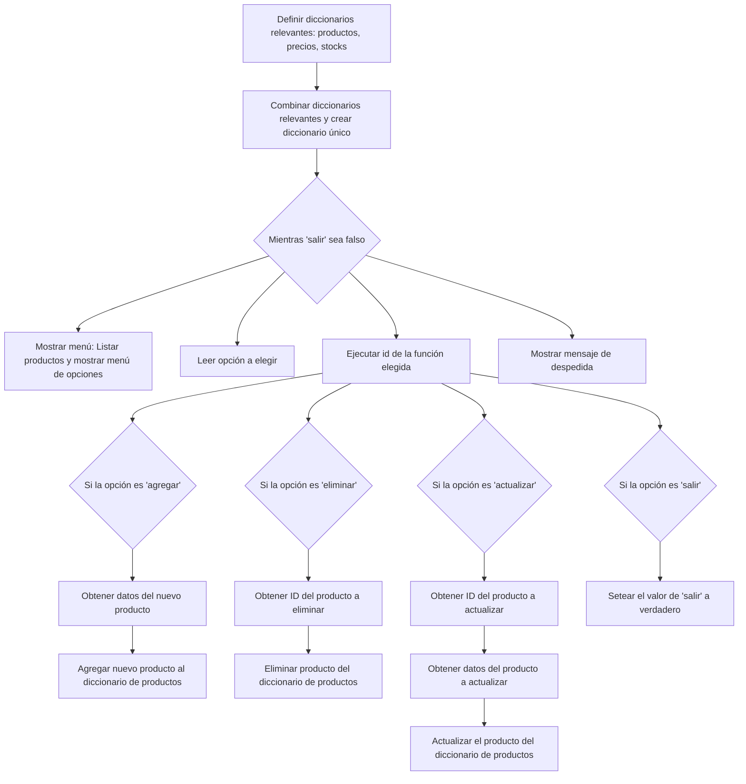

# Test 01 - Python

Se deberá realizar un CRUD de prendas de vestir.

## Ejercicio

```python
# Se tienen los siguientes diccionarios:
# PROGRAMA PRINCIPAL

Productos = {1:'Pantalones', 2:'Camisas', 3:'Corbatas', 4:'Casacas'}
Precios = {1:200.00, 2:120.00, 3:50.00, 4:350.00}
Stock = {1:50, 2:45, 3:30, 4:15}

# Elaborar un programa que muestre los diccionarios, y programar las siguientes acciones:
# [1] Agregar
# [2] Eliminar
# [3] Actualizar
# [4] Salir
```

## Analisis

Se deberá crear un menú con las 4 opciones mencionadas:

1. Agregar:

   Esta opción permite agregar nuevos productos. Deberá desplegar adecuadamente un formulario para pedir los siguientes datos: nombre de producto, precio y stock inicial. Si todos los datos son ingresados correctamente, se genera un nuevo producto con id único.
   También se podrá cancelar la operación si fuese el caso.

2. Eliminar

   Esta opción permite eliminar productos existentes. Para ello se deberá ingresar el id del producto a eliminar. Se mostrará mensaje con el nombre y id del producto para confirmar la eliminación.

3. Actualizar:

   Esta opción permite actualizar un producto. Para ello será necesario indicar el id del producto a editar. Luego se preguntará por cada atributo si se desea actualizar. En caso se desee actualizar un atributo específico, se deberá indicar el valor adecuadamente:

   1. Actualizar nombre: Se deberá ingresar un nombre no nulo.
   2. Actualizar precio: Se deberá ingresar un número.
   3. Actualizar stock: Se deberá ingresar si se desea aumentar, reducir o nuevo valor.
      1. Si se elige aumentar o reducir, se deberá ingresar un entero que disminuye o aumenta al stock actual del producto. Si el stock resultante es negativo entonces se cancela la operación y se envía un mensaje de error.
      2. Si se elige nuevo valor, entonces el valor ingresado reemplazará al stock actual. Este valor no puede ser negativo.

4. Salir:

   Deberá detener el programa.

El menú deberá mostrar adecuadamente la lista de productos actual y listar las opciones.

**Ejemplo de salida:**

```
=========================================
           Lista de Productos:
=========================================
1        Pantalones         200.0      50
2        Camisas            120.0      45
3        Corbatas           50.0       30
4        Casacas            350.0      15
=========================================

[1] Agregar, [2] Eliminar, [3] Actualizar, [4] Salir
Elija opción:
```

Entrada de datos: El programa no necesita ninguna entrada específica.
Salida de datos: Lista de productos y menú de opciones.

## solution

### Algoritmo

De acuerdo al análisis previo se propone el siguiente algoritmo:

```
1. Definir diccionarios relevantes: productos, precios, stocks
2. Combinar diccionarios relevantes y crear diccionario único
3. Mientras "salir" sea falso:
   1. Mostrar menu:
      1. Listar productos
      2. Mostrar menu de opciones
   2. Leer opción a elegir
   3. Ejecutar id de la función elegida
      1. Si la opción es "agregar":
         1. Obtener datos del nuevo producto
         2. Agregar nuevo producto al diccionario de productos.
      2. Si la opción es "eliminar":
         1. Obtener ID del producto a eliminar
         2. Eliminar producto del diccionario de productos
      3. Si la opción es "actualizar"
         1. Obtener ID del producto a actualizar
         2. Obtener datos del producto a actualizar
         3. Actualizar el producto del diccionario de productos
      4. Si la opción es "salir", se deberá setear el valor de "salir" a verdadero.
4. Mostrar mensaje de despedida
```

**Algoritmo en lenguaje mermaid:**



### Variables relevantes

1. Diccionario de productos: me permitirá listar y manipular la lista a lo largo de todo el programa.
2. Diccionario de opciones: Contendrá la lista de opciones

#### Diccionario de productos

Para mejorar la experiencia de desarrollo, se combinará los tres objetos dados en uno solo:

```python
products = {
  1: {
    name: 'Pantalones',
    price: 200.00,
    stock: 50
  },
  ...
}

print(products[1].stock) # Acceder al stock del producto 1
```

#### Diccionario de opciones

El diccionario de opciones deberá contener entre otros datos: el id de la opción, el nombre y la función a ejecutar.

```python
options = {
  1: {
    name: 'Agregar',
    fn: agregar
  },
  ...
}

agregar(products) # La función permite agregar un nuevo producto
```

### Funciones relevantes

1. agregar: Agregar producto
2. eliminar: Eliminar producto
3. actualizar: Actualizar producto
4. salir: Retorna un booleano indicando si el programa debe terminarse o no.
5. getNewProduct: Obtiene los datos de un producto nuevo a través de un formulario.
6. getProductId: Obtiene el id del producto a través de un formulario
7. getProductData: Obtiene los datos del producto a actualizar a través de un formulario
8. getProductsDicc: Combina los diccionarios de productos, precios y stocks en uno solo
9. getOption: Obtiene la opción del menú

#### Obtner un nuevo producto

La función getNewProduct maneja la interfaz de usuario que recopila los datos del producto a crear.

Esta función será utilizada por la función "agregar" para obtener los datos del producto a agregar.

Modo de uso:

```python
product = getNewProduct() # Obtener datos del producto
```

## Development

El proyecto deberá incluir los siguientes requisitos:

## Plan

- [x] Crear repositorio del proyecto en github
- [x] Añadir README del repositorio
- [ ] Desarrollar programa
- [ ]
